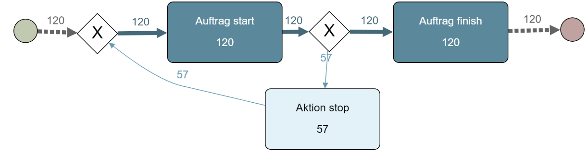

            <section data-markdown>
                <textarea data-template>
                  <h1><mark style="background-color: white">proto_cube</mark></h1>
                  <!-- .slide: data-background="proto_cube/rev_pi.png" -->
                  
<mark style="background-color: white">Industrie 4.0 zur integrativen Erfassung von Betriebs und Maschinendaten</mark>
 
                  ---
                  ## Ziel
                  Wir wollen mehr Informationen über Prozesse an Maschinen
                  ---
                  ## WAS WIRD GEMACHT?
                  1. Sensordaten erfassen
                  2. Kommunikation ermöglichen
                  3. IoT-/Datenplatform einrichten
                  4. Erfassung von zusätlichen Daten über Web-App
                  ---
                  ## Technologische Struktur
                  
                  ---
                  ## proto_cube App
                  - [zur App akt. Google](https://google.de)
                  - [zu Grafana akt. Google](https://google.de)
                  ---
                  ## Daten aus App 

                  ---
                  ## Datenanalyse
                  
                  ---
                  ## Sensordaten
                  
                  ---
                  ## Integration der Daten
                  - Schwimmlinien
                  - Zeitstrahlen überlagern
                  ---
                  # Danke für eure Aufmerksamkeit
                  <small>Jonathan Hoß</small>
                </textarea>
            </section>